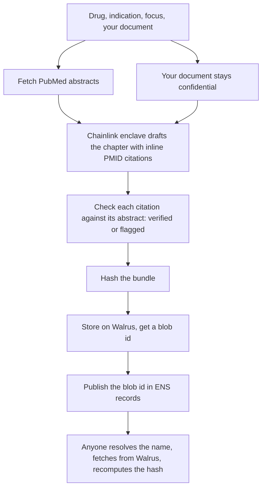

# Lineage

HEOR Provenance Agent

Lineage drafts a single, targeted chapter of a pharmaceutical value dossier and makes every claim in it checkable. You give it a source document of your own, it pulls supporting literature from PubMed, drafts the chapter with inline citations, and then checks each of those citations against its source before you read a word of it. The finished chapter is hashed and published so anyone can confirm later that it was not altered.

Built at ETHGlobal New York 2026.

Quick look: open the app, stay on the Verify tab, and load the example. You get a finished chapter, a banner saying how many of its citations were verified against their sources, and a chain of custody you can follow back to the original bytes. None of that needs a key or a wallet.

## The problem

Health economics teams write Global Value Dossiers, the evidence packages a drug uses to win reimbursement. They are long and slow to produce, so large language models are an obvious way to speed them up. The catch is trust. A 2024 ISPOR study from IQVIA had subject matter experts review dossier chapters drafted by an LLM. They found the output good enough to build on, but only with manual checking, and with hallucinations present, and they concluded that expert review is essential. Guidance from NICE, the FDA, the EMA, and an ISPOR working group points the same way: if AI touches the evidence, you need traceability, human oversight, and an audit trail.

So the hard part is not the drafting. It is proving that each claim came from a real source that actually supports it, and that nothing was changed afterward. If you cannot trace the lineage, you cannot use it. That is the gap this fills.

## What it does

You provide a drug, an indication, an optional focus (the section or angle you want), and your own source document. That document can be confidential, for example unpublished trial data you would never paste into a public chatbot.

1. It fetches abstracts for the drug and indication from PubMed.
2. It sends those abstracts and your document into a confidential enclave, which drafts the chapter with inline citations. Your document never leaves the enclave and never reaches a public model.
3. It checks every citation. For each cited PMID it compares the sentence against the real abstract and marks the citation as verified or flagged for review.
4. It hashes the whole package, stores it, and publishes a pointer to it so the result can be checked by anyone later.

The citation check is the part that matters. The model writes fluent prose and attributes it poorly, so Lineage does not take its word for any citation. It verifies each one and shows the score, for example "9 of 13 citations verified against source, 4 flagged for review." Drafting is the model's job. Verifying is the tool's job.

## How verification works



Three networks do three jobs.

ENS holds a human readable name and a small set of records that point to the current evidence bundle. It is the entry point, and it ties that pointer to an owner with no server of ours in the path. To check a dossier you start from the name, read the record, and follow it.

Walrus is decentralized storage. The evidence bundle lives there, addressed by its content, so any change to the bytes would fail to match.

Chainlink Confidential AI runs the drafting model inside a hardware enclave and returns attestation digests. That is how a confidential document gets analyzed without anyone seeing it, while still leaving proof of what was processed.

The Verify view runs this chain live. The tamper test lets you edit a claim and watch the hash stop matching, which is the same idea made concrete.

## Running it

You do not need keys to see the project work. Clone it, install, run, and load the example on either tab.

```
git clone <your repo url>
cd lineage
npm install
npm run dev
```

Open http://localhost:3000. The Verify tab reads from a bundled example and a public Sepolia endpoint, so it works on a fresh clone with nothing configured. The citation view and the tamper test work offline.

A live generation needs keys, because it calls the Chainlink enclave, PubMed, Walrus, and ENS. Put them in a local `.env` (which is never committed) or in your host's dashboard.

Required for live generation:

- `CHAINLINK_CONF_AI_KEY`
- `SEPOLIA_RPC_URL` (your own Alchemy or Infura Sepolia endpoint)
- `ENS_PRIVATE_KEY` (the throwaway Sepolia key that owns the name)
- `ENS_NAME` (for example `heor-prov.eth`)

Optional, with working defaults in code:

- `CHAINLINK_CONF_AI_URL`, `WALRUS_PUBLISHER`, `WALRUS_AGGREGATOR`, `NCBI_API_KEY`, `NCBI_TOOL`, `NCBI_EMAIL`

See `.env.example` for the full list and where each value comes from.

## Live demo

Hosted at <your deployed url>. The Verify tab works for anyone. Generate needs the keys above and takes one to two minutes, since it waits on the enclave.

One note on the enclave: it is a developer preview, and its availability comes and goes. If a live generation hangs, that is the preview being slow or down, not the app, and the example path stays instant regardless. Use synthetic documents only on the generate path, because the preview may log inputs.

## Scope

Lineage drafts one targeted chapter, not a whole dossier. A real GVD runs to a hundred pages or more, and producing the entire thing is neither realistic here nor the point. The focus field selects the section. The value is that the section it produces is grounded and independently checked.

This is a proof of concept on test networks. ENS is on Sepolia. Walrus and Chainlink run on testnet and developer preview. It assists a human writer rather than replacing one.

## Tech

Next.js and TypeScript. PubMed E-utilities for evidence. Walrus testnet HTTP for storage. ENS on Sepolia through viem and ensjs. Chainlink Confidential AI developer preview for the enclave. Document parsing with mammoth for Word, pdf-parse for PDF, and plain reads for text.

## References

IQVIA, ISPOR Europe 2024. Evaluating LLM Performance in Content Generation for Global Value Dossiers (poster MSR110).

IntuitionLabs. LLMs for Clinical Evidence: Automating Economic Dossiers.