# HEOR Provenance Agent

**Grounded drafting of pharma value-dossier sections, where every claim is independently verifiable and every artifact is tamper-evident.**

Built at ETHGlobal New York 2026. The product is not the text generation — it's the **provenance and verification layer** that makes AI-drafted evidence usable in a regulated setting.

> Try it yourself: open the Verify view, enter **`heor-prov.eth`**, and watch the system resolve the name → pull the evidence bundle from decentralized storage → recompute its hash → confirm nothing was altered. You don't have to trust the server.

---

## Quickstart (zero config — no keys, no wallet)

```bash
git clone <repo-url>
cd heor-provenance
npm install
npm run dev
# open http://localhost:3000
```

You land on the **Verify** view showing a real, previously published dossier (`heor-prov.eth`) rendered from a bundled snapshot — **with no environment variables set.** From there:

1. **Click an inline `[PMID]` citation** on any claim to open its exact PubMed source (hover to preview the supporting sentence).
2. Skim the **“N/N claims grounded; ungrounded dropped”** line, the Walrus **blobId**, and the Chainlink **confidential attestation** block (model, AWS Nitro enclave, the three digests).
3. Press **“Verify live on-chain”** to run the real ENS → Walrus → re-hash round trip and see the live `sha256` match. (Reads default to a public Sepolia RPC, so this works on a clean clone.)
4. **Edit any claim's text and hit “Re-verify”** → the hash breaks and the banner flips to **“PROVENANCE FAILED — content altered, hash no longer matches,”** with before/after hashes. **Reset** restores it.

**Generate** (drafting a *new* dossier) is **optional and requires API keys + a funded Sepolia key** — see [Generate (requires keys)](#generate-requires-keys). Without keys, the Generate tab just explains what's needed; nothing errors.

---

## The problem

Health Economics & Outcomes Research (HEOR) teams compile **Global Value Dossiers (GVDs)** — the evidence story a drug uses to win reimbursement. Drafting them is slow and expert-heavy, and LLMs are an obvious accelerant. A 2024 ISPOR study (IQVIA) found LLM-generated GVD chapters were rated good enough to fold into real dossier development by subject-matter experts — *but only with manual checking, and with hallucinations present, concluding that SME review is essential.* More broadly, HTA bodies and regulators (NICE, FDA, EMA, and an ISPOR generative-AI working group) are converging on the same requirement: if AI touches the evidence, you need **transparency, reproducibility, human oversight, and an audit trail.**

That last requirement is the gap. The blocker isn't whether AI can draft — it's that in a regulated workflow you can't use an AI claim unless you can prove **(a)** exactly which source it came from and **(b)** that nothing was altered after the fact. *If you can't trace the lineage, you can't use it.*

This project builds that missing layer.

## What it does

Given a drug and an indication, it:

1. Pulls **real PubMed abstracts** as evidence.
2. Drafts dossier claims where **each claim is tied to one PMID and the exact supporting sentence**; claims that can't be grounded are flagged or dropped (human-in-the-loop, not autonomous authoring).
3. Optionally analyzes a **confidential, pre-publication document** (e.g. embargoed trial data) inside a trusted execution environment, so private evidence never leaks — and attaches the enclave attestation.
4. Bundles everything, hashes it, stores it on decentralized storage, and publishes a human-readable pointer to it.
5. Lets anyone **verify the whole chain** from a single name — no trust in our server required.

## Architecture — three chains, three distinct jobs

```mermaid
flowchart LR
    A["Drug + Indication<br/>(+ optional confidential doc)"] --> B["PubMed E-utilities<br/>fetch abstracts"]
    B --> C["LLM: claim-level<br/>grounded drafting<br/>(claim ↔ PMID + sentence)"]
    D["Confidential doc"] -.optional.-> E["Chainlink Confidential AI<br/>TEE inference + attestation"]
    C --> F["Evidence Bundle<br/>{claims, sources, model,<br/>version, timestamp,<br/>attestation?, sha256}"]
    E -.digests.-> F
    F --> G["SHA-256 over all<br/>fields except sha256"]
    G --> H["Walrus<br/>store bundle bytes<br/>→ blobId"]
    H --> I["ENS text records<br/>heor.dossier.latest = blobId<br/>+ agent version / capabilities"]

    I --> V1["VERIFY: resolve ENS name"]
    V1 --> V2["read blobId"]
    V2 --> V3["fetch bundle from Walrus"]
    V3 --> V4["recompute SHA-256<br/>and compare"]
    V4 --> V5["PROVENANCE VERIFIED ✓"]
```



| Layer | Chain | Job |
|---|---|---|
| **Storage** | **Walrus (Sui)** | Stores the evidence-bundle bytes on tamper-evident decentralized storage; the content hash makes any alteration detectable. |
| **Identity / pointer** | **ENS (Sepolia)** | A human-readable name (`heor-prov.eth`) whose text records point to the latest bundle and publish the agent's version + capabilities. |
| **Confidential compute** | **Chainlink Confidential AI Attester** | Runs inference over sensitive inputs inside an AWS Nitro enclave and returns content/request/response **digests** — proof the AI step ran on the stated input without leaking it. |

## The loop, in detail

**Generate** (`npm run generate-full` / `POST /api/generate`):
drug + indication → PubMed abstracts → claim-level grounded claims → *(if a confidential doc is supplied)* Chainlink TEE inference + attestation → assemble bundle → SHA-256 → store on Walrus (`epochs ≥ 5`) → write `blobId` and agent metadata into ENS text records.

**Verify** (`npm run verify` / `POST /api/verify`):
resolve ENS name → read `heor.dossier.latest` (blobId) → fetch bundle from Walrus → recompute SHA-256 over all fields except `sha256` → compare → render **PROVENANCE VERIFIED**, surfacing the dossier, the grounded claims with their PMIDs, and the confidential attestation digests.

## How it maps to the sponsor tracks

- **ENS — Integrate ENS:** functional, non-hard-coded read **and write** of ENS text records on Sepolia; the name is the discovery and integrity anchor for every dossier.
- **Walrus (Sui) — Best new build with Walrus:** newly built; Walrus is the load-bearing storage for the verifiable evidence bundle, not a bolt-on.
- **Chainlink — Best usage of Confidential AI Attester:** real confidential inference over sensitive inputs in the dev-preview enclave, with the attestation digests folded into the hashed bundle so the confidential step is itself verifiable.

## Tech stack

- **Next.js + TypeScript** (single repo; API routes keep all keys server-side).
- **LLM:** provider-agnostic OpenAI-compatible client (`LLM_BASE_URL` / `LLM_API_KEY` / `LLM_MODEL`) — runs on Groq by default.
- **Evidence:** PubMed E-utilities (`esearch` + `efetch`).
- **Walrus:** testnet HTTP publisher/aggregator (no wallet needed).
- **ENS:** Sepolia via `viem` / `@ensdomains/ensjs`.
- **Chainlink:** Confidential AI dev-preview REST API (async submit → poll → digests).

## Running it locally

```bash
npm install

# CLI: generate a dossier and publish its provenance
npm run generate-full -- --drug semaglutide --indication "type 2 diabetes"
# add a confidential input (SYNTHETIC data only — see note below)
npm run generate-full -- --drug semaglutide --indication "type 2 diabetes" --sensitive ./path/to/synthetic-doc.txt

# verify any published dossier from its ENS name alone
npm run verify -- --name heor-prov.eth

# run the web app
npm run dev
```

## Generate (requires keys)

The **Verify** demo above needs no configuration. Drafting a *new* dossier — the **Generate** tab and `npm run generate-full` — calls an LLM and writes to Walrus + ENS, so it needs the keys below. If they're absent, the Generate tab shows a short "needs keys" message instead of erroring.

### Environment variables

Set these locally in `.env` (never commit it — the repo is public) and in the Vercel dashboard for deployment.

**Required**
- `LLM_BASE_URL` — e.g. `https://api.groq.com/openai/v1`
- `LLM_API_KEY`
- `LLM_MODEL` — e.g. `llama-3.3-70b-versatile`
- `SEPOLIA_RPC_URL` — your own Alchemy/Infura Sepolia endpoint
- `ENS_PRIVATE_KEY` — the throwaway Sepolia key that owns the ENS name
- `ENS_NAME` — e.g. `heor-prov.eth`

**Required only for the confidential-document feature**
- `CHAINLINK_CONF_AI_KEY`

**Optional (sensible defaults in code)**
- `CHAINLINK_CONF_AI_URL`, `WALRUS_PUBLISHER`, `WALRUS_AGGREGATOR`, `NCBI_API_KEY`, `NCBI_TOOL`, `NCBI_EMAIL`

> **Deploy note:** the generate flow runs 1–2 minutes, which exceeds Vercel's Hobby 60 s function limit, so `/api/generate` needs Pro (or extended/Fluid compute). `/api/verify` runs fine on any plan — the recommended demo path is to pre-generate from the CLI and use the deployed Verify view live.

## Honest scope & limitations

- **Augmentation, not automation.** This drafts grounded claims for human review; it does not autonomously author regulatory submissions. The verifiability layer is the point.
- **Synthetic data only for confidential inputs.** The Chainlink Confidential AI dev preview may log inputs, so never send real PHI — use fabricated documents.
- **Testnets.** ENS is on Sepolia and Walrus/Chainlink are on testnet/dev-preview; this is a proof of concept, not production.
- **ENS v2 transition:** the name lives in the ENS v2 Sepolia deployment. If Sepolia state is reset by a redeploy, re-run `ens-find-controller` → `ens-register` → `ens-write` to re-mint and rewrite the records.

## References

- IQVIA / ISPOR Europe 2024 — *Evaluating LLM Performance in Content Generation for Global Value Dossiers* (poster MSR110).
- IntuitionLabs — *LLMs for Clinical Evidence: Automating Economic Dossiers* (review of TrialMind, AI-LES, Reason et al., and NICE/FDA/EMA/ISPOR guidance).

---

*[FILL IN before submitting: repo URL, author name, deployed app URL, ≤5-min demo video link, and a LICENSE.]*